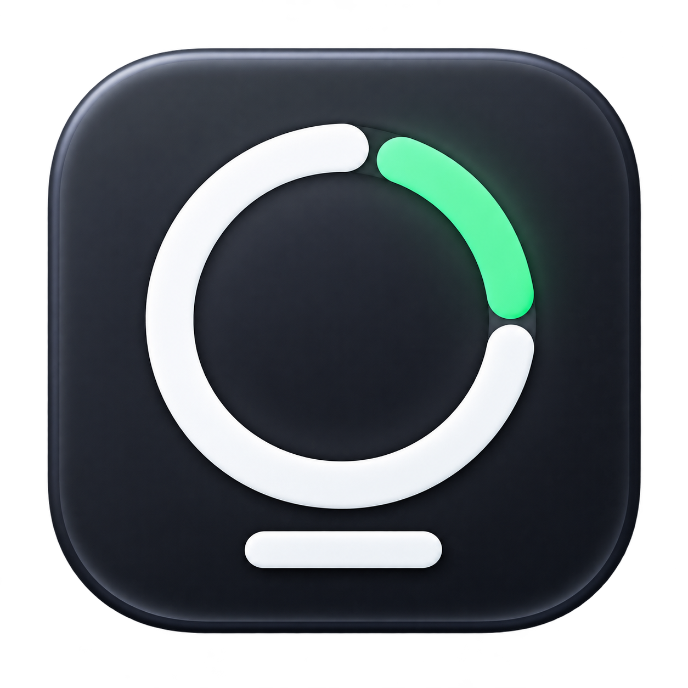

<p align="center">
  
</p>

# Token Menu

[English](README.md) · [한국어](README.ko.md)

Token Menu is an open-source macOS menu bar utility for monitoring usage limits from supported AI coding services such as Codex and Claude Code.

See your remaining allowance at a glance, open usage details from the menu bar, and keep your Dock clear.

**[Download the latest DMG](https://github.com/kimjaeyun124/token-menu/releases/latest)**

## Features

- Remaining usage in the menu bar, with the 5-hour window preferred by default.
- Weekly limits and reset countdowns, including days when applicable.
- A compact usage panel with Refresh, Settings, and Quit.
- Per-service visibility, ordering, refresh intervals, and low-allowance notifications.
- White provider icons by default, with configurable colors.
- English and Korean interfaces, launch at login, and an optional Control–Option–C shortcut.
- Settings that open on the current desktop, with a minimum window size and full-row sidebar buttons.

Token Menu shows service-provided usage limits, not estimated token counts. Missing data appears as unavailable, never as zero.

## Service support

| Service | Current behavior |
| --- | --- |
| Codex | Reads live limits through the installed, authenticated Codex app-server. |
| Claude Code | Reads live 5-hour and 7-day limits from Claude Code's documented status-line JSON bridge (Claude.ai subscribers only). |

### Claude Code status-line setup

Claude Code 2.1.80 and later passes subscription rate limits to a configured status-line command. Token Menu includes a bridge at `support/claude-statusline-token-menu.sh` that stores only that JSON payload (never credentials or cookies). Add it to your Claude Code `~/.claude/settings.json`:

```json
{
  "statusLine": {
    "type": "command",
    "command": "/absolute/path/to/token-menu/support/claude-statusline-token-menu.sh"
  }
}
```

Keep Claude Code running and complete one response; Token Menu will then show the latest 5-hour and weekly remaining percentages. If `statusLine` is already configured, compose the bridge with your existing command rather than replacing it. Rate limits are absent for API-key and unsupported plans, so the app reports an unavailable state instead of fabricating a value.

## Install

Requires **macOS 13 or later**. The universal DMG includes Apple Silicon and Intel executables. Runtime checks are performed on Apple Silicon; Intel and macOS 13 have not been runtime-tested.

1. Download the DMG from [Releases](https://github.com/kimjaeyun124/token-menu/releases/latest).
2. Open it and drag **Token Menu.app** into **Applications**.
3. Launch Token Menu from Applications once.
4. Click the usage indicator in the menu bar to open the usage panel.
5. Optionally enable **Settings → General → Launch at Login**.

The current release is ad-hoc signed and **not Apple-notarized**. macOS may block the first launch. After verifying that you trust the download, use **System Settings → Privacy & Security → Open Anyway**. Token Menu does not require disabling Gatekeeper.

When upgrading from Codex Usage, quit the old app before launching Token Menu. Existing preferences are retained; avoid running both versions together.

Sign in through your installed Codex CLI or desktop app before requesting usage. If a query times out, try Refresh again; a service timeout does not mean your remaining allowance is zero.

## Privacy

Authentication is handled by the installed Codex process. Token Menu does not read or copy credential files, browser cookies, API keys, or authorization headers. It does not log raw service responses or estimate usage when the service is unavailable.

## Build and test

Install Xcode or the Command Line Tools and a Swift toolchain compatible with the package (Swift 5.9 or later).

```sh
git clone https://github.com/kimjaeyun124/token-menu.git
cd token-menu

# Deterministic tests; the live-service check is skipped by default.
swift test

# Optional: query the installed, authenticated Codex service separately.
CODEX_LIVE_TEST=1 swift test --filter CodexUsageTests.testLiveCodexProviderWhenExplicitlyEnabled

# Universal app and compressed DMG, including the app icon.
./scripts/build-dmg.sh
open "dist/Token Menu.app"
```

Outputs: `dist/Token Menu.app`, `dist/token-menu-1.0.1-macOS-universal.dmg`, and its `.sha256` checksum. Set `ARCHITECTURE=arm64` or `ARCHITECTURE=x86_64` for a single-architecture build. Use `SKIP_BUILD=1 ./scripts/build-dmg.sh` to package an already-built app.

See [distribution notes](docs/distribution.md) for signing, release commands, and verification limits. Internal Swift target names and bundle identifiers remain stable to preserve saved settings.

## License

Token Menu is open-source software licensed under the MIT License.

You are free to use, copy, modify, distribute, and use the source code commercially in accordance with the MIT License.

See [LICENSE](LICENSE) for the full license text. Third-party provider logos, trademarks, and brand assets are **not covered** by Token Menu's MIT License; see [NOTICE.md](NOTICE.md).

## Trademark Notice

Codex, OpenAI, ChatGPT, and their associated names, logos, and marks are trademarks or other intellectual property of OpenAI.

Claude, Anthropic, and their associated names, logos, and marks are trademarks or other intellectual property of Anthropic.

Third-party names, logos, icons, and brand assets included in or referenced by Token Menu are not licensed under the MIT License and remain subject to the rights and policies of their respective owners.

Token Menu is an independent third-party project and is not affiliated with, endorsed by, sponsored by, or officially associated with OpenAI or Anthropic.
